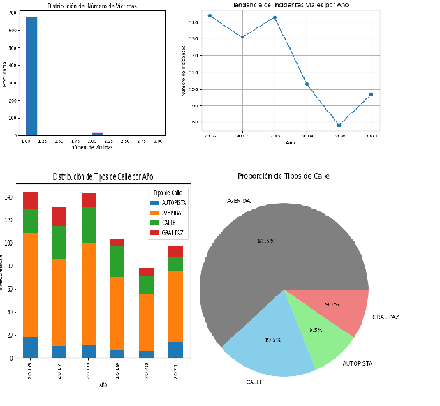
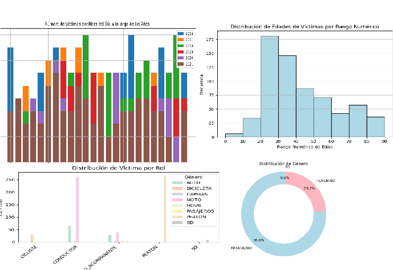

<h1 align="center"> PROYECTO SINIESTROS VIALES 🚀</h1>

## INTRODUCCION
En este proyecto se realiza un determinado analisis de los siniestros viales en los años comprendidos entre
2016 a 2021 en la ciudad de Buenos Aires. La informacion es extraida de El Observatorio de Movilidad y Seguridad Vial (OMSV), centro de estudios que se encuentra bajo la órbita de la Secretaría de Transporte del Gobierno de la Ciudad Autónoma de Buenos Aires.

Este proyecto nos permitira obtener un informe respecto a los diferentes acontecimientos relacionados a los accidentes que involucran vehiculos en las vias publicas. este sera un informe interactivo, que presenta un análisis respaldado por datos que atraves de una serie de KPIs nos permitira comprender y sacar conclusiones presente en estos hechos.

## OBJETIVO

Cumplir el Rol de Data Analytic con el fin de generar información que le permita a las autoridades locales tomar medidas para disminuir la cantidad de víctimas fatales de los siniestros viales.

** KPIs

* Indicador de  Porcentaje de Víctimas en Avenidas

* Reducir en un 10% la tasa de homicidios en siniestros viales de los últimos seis meses, en CABA, en comparación con la tasa de homicidios en siniestros viales del semestre anterior

* Reducir en un 7% la cantidad de accidentes mortales de motociclistas en el último año, en CABA, respecto al año anterior

## PROCESOS

Este repositorio contiene los archivos csv, objeto del desarrollo de este proyecto : 'data_hechos.csv' y 'data_victimas'.

 - ETL: Apartir de los archivos csv suministrados, se realizaron las trasnformacion necesarias a evaluar en el proyecto. A destactar pasos tales como la seleccion de campos especificos, cambio de tipo de variables y estudio y evalucaion de cada dato presente.

 - EDA: analisis exploratorio de datos
 En este apartado se toman los datos despues de su transformacion con el proposito de analizar visualmente el comportamiento y tendencias de las variables y ademas determinar datos destacados respecto al caso de estudio.
  1. Estadistica Descriptiva
  2. Visualizacion de los Datos
    Histograma
    Serie de tiempo
    gráfico de pastel
    Grafico de barras agrupadas
    Grafico de barras apiladas
    Matriz de correlación
    Dispersion
    Digrama de caja

  3. Analisis de los datos

  Se destacan estos analisis basicos de los datos:

  - Del periodo de años comprendido en la data, los años con mayor cantidad de incidentes son 2016 y 2018 con mas de 140.

  - La principal via donde se presentan los accidentes es en la Avenida y la Gral Paz destaca como la mas segura.

  - las edades entre 20 y 40 años tienen una mayor frecuencia de incidentes viales.

  - En las victimas el genero que predomina es el masculino.

  - los Conductores son de mayoria Masculino y este rol segun los registro es la victima mayor de los siniestros viales.

  - El vehiculo Moto son la de mayor cantidad de accidentes en la ciudad de Buenas Aires.

  - La franja horaria de las 10:00 es en la que se presentan una mayor cantidad de victimas.

 ## DASHBOARD: 

 ## ANALISIS DE KPIs Y VISUALIZACIONES

  - Indicador de  Porcentaje de Víctimas en Avenidas, Este KPI proporciona información sobre la proporción de víctimas que ocurren en avenidas en comparación con el número total de víctimas en todos los tipos de calles. 

  - Reducir en un 10% la tasa de homicidios en siniestros viales de los últimos seis meses, en CABA, en comparación con la tasa de homicidios en siniestros viales del semestre anterior
  Definimos a la tasa de homicidios en siniestros viales como el número de víctimas fatales en accidentes de tránsito por cada 100,000 habitantes en un área geográfica durante un período de tiempo específico. Su fórmula es: (Número de homicidios en siniestros viales / Población total) * 100,000
  
  - Reducir en un 7% la cantidad de accidentes mortales de motociclistas en el último año, en CABA, respecto al año anterior
  Definimos a la cantidad de accidentes mortales de motociclistas en siniestros viales como el número absoluto de accidentes fatales en los que estuvieron involucradas víctimas que viajaban en moto en un determinado periodo temporal. Su fórmula para medir la evolución de los accidentes mortales con víctimas en moto es: (Número de accidentes mortales con víctimas en moto en el año anterior - Número de accidentes mortales con víctimas en moto en el año actual) / (Número de accidentes mortales con víctimas en moto en el año anterior) * 100 
  
   

## Tecnologia usada

## Fuente de Datos

 [BUENOS AIRES DATA](https://data.buenosaires.gob.ar/dataset/victimas-siniestros-viales)

## Autor

Ramiro Andres Tejedor Gonzalez