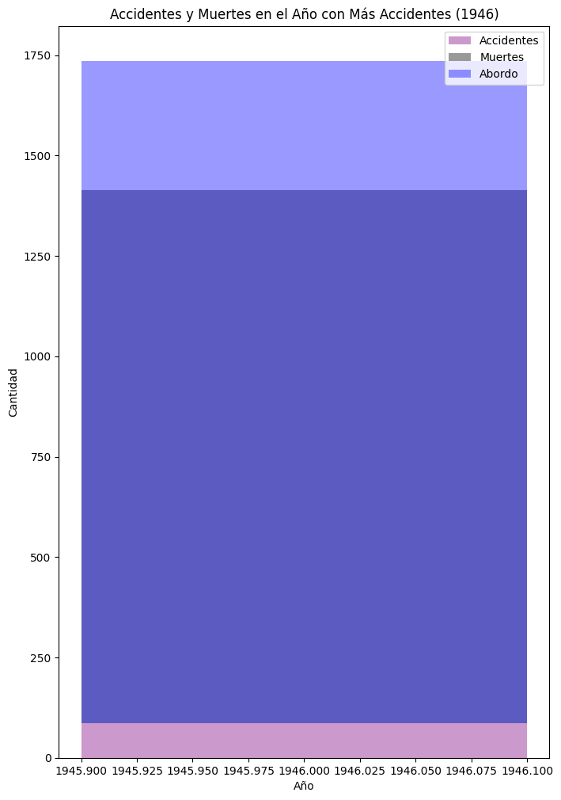
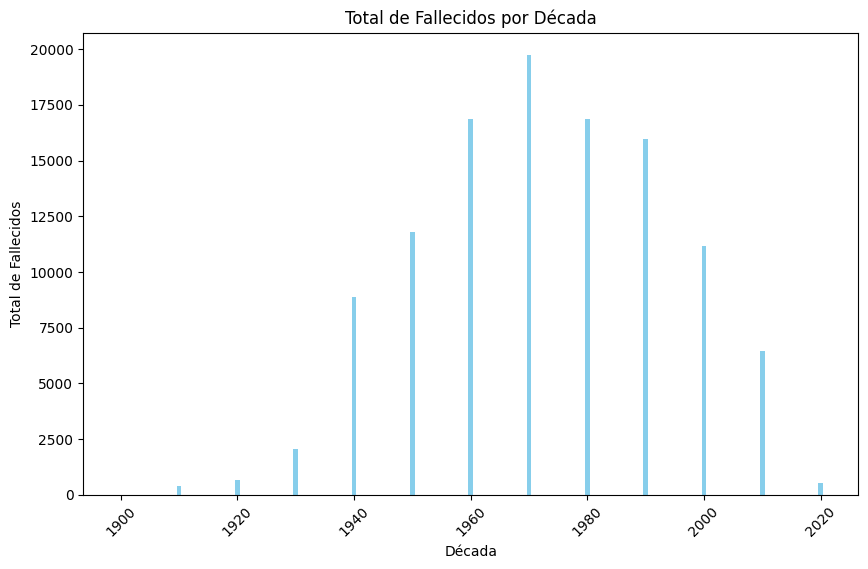
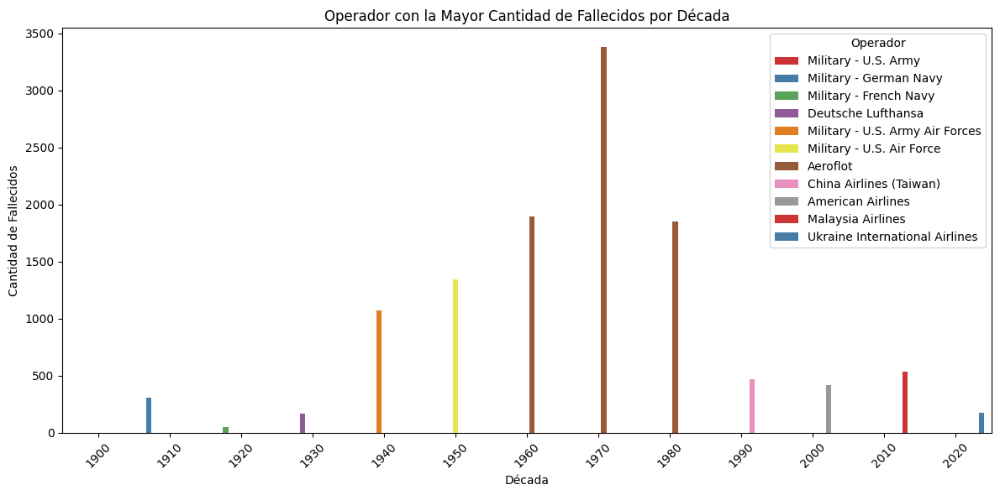
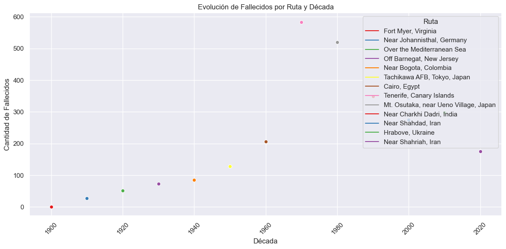
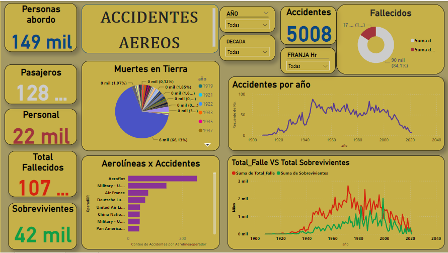
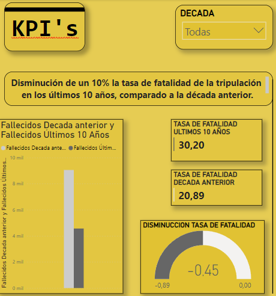

<h1 align="center"> PROYECTO SINIESTROS VIALES 🚀</h1>

## INTRODUCCION
Los accidentes aéreos son eventos trágicos que pueden causar la muerte de muchas personas. Las causas de estos accidentes son variadas, pero pueden incluir errores humanos, fallas mecánicas o condiciones climáticas adversas.

En este proyecto se realiza un determinado analisis de los accidentes aereos en los años comprendidos entre
1946 hasta la actualidad. La informacion es extraida de una data suministrada 'AccidentesAereos.csv', que contiene todos los registros de los siniestros hasta la fecha.
La data contiene estas campos de informacion:

- fecha: representa la fecha en que ocurrió el accidente de avión.

- HORA declarada: representa la hora declarada o reportada del accidente.

- Ruta: representar la ruta o el trayecto del vuelo involucrado en el accidente.

- OperadOR:representa la aerolínea u operador del vuelo.

- flight_no: contiene el número de vuelo involucrado en el accidente.

- route: contener información describir el tipo de evento o actividad que tuvo lugar en la ubicación o ruta especificada.

- ac_type: representa el tipo de aeronave involucrada en el accidente.

- registration: contener información sobre el registro o matrícula de la aeronave.

- cn_ln: representar el número de serie o identificación única de la aeronave.

- all_aboard: Esta representa el número total de personas a bordo de la aeronave en el momento del accidente. Esto incluye tanto a los pasajeros como a la tripulación (la tripulación de vuelo, como pilotos y asistentes de vuelo).

- PASAJEROS A BORDO: Esta se refiere al número de pasajeros que estaban a bordo de la aeronave en el momento del accidente. Excluye a la tripulación de vuelo y se centra solo en los pasajeros.

- crew_aboard: Esta se refiere al número de miembros de la trip ulación de vuelo que estaban a bordo de la aeronave en el momento del accidente. Incluye a los pilotos y otros miembros del personal de vuelo, pero no a los pasajeros.

- cantidad de fallecidos: representa el número total de personas fallecidas en el accidente.

- passenger_fatalities: representar el número de pasajeros fallecidos en el accidente.

- crew_fatalities: representar el número de tripulantes fallecidos en el accidente.

- ground: representar el número de personas en tierra que se vieron afectadas por el accidente.

- summary: contener un resumen o descripción del accidente.

## OBJETIVO

Evaluar la disminución de un 10% la tasa de fatalidad de la tripulación en los últimos 10 años, comparado a la década anterior.

Definimos la tasa de fatalidad de la tripulación como el número total de tripulantes fallecidos en los accidentes registrados en la década a considerar, dividido en la cantidad total de accidentes aéreos ocurridos en este período de tiempo. Su fórmula es (Suma total de fallecidos en el período de tiempo / Suma total de accidentes en el período de tiempo).

## PROCESOS

Este repositorio contiene los archivos csv, objeto del desarrollo de este proyecto : 'AccidentesAereos.csv'.

- ETL: Apartir del archivo csv suministrado, se realizaron las trasnformacion necesarias a evaluar en el proyecto. A destactar pasos tales como la seleccion de campos especificos, cambio de tipo de variables y estudio y evalucaion de cada campo relevante presente.

- EDA: analisis exploratorio de datos
 En este apartado se toman los datos despues de su transformacion con el proposito de analizar visualmente el comportamiento y tendencias de las variables y ademas determinar datos destacados respecto al caso de estudio.

1. Estadistica Descriptiva
2. Visualizacion de los Datos
    Histograma
    Serie de tiempo
    gráfico de pastel
    Grafico de barras agrupadas
    Grafico de barras apiladas
    Matriz de correlación
    Dispersion
    Digrama de caja

3. Analisis de los datos

* Año con más y menos accidentes son 1946 (88 accidentes) y 1908 (1 accidentes)
* Los años en la data sin accidentes[1910, 1911, 1914]
* La franja horaria con mas accidentes 11 con un total de 211
* El operador con mas accidentes Aeroflot con un total de 253
* El operador con menos accidentes Air Taxi - Bohemia Inc. con un total de 1
* 155.326 personas abordaron una aereonave en estos accidentes, 111.396 fallecieron y 43.929 sobrevivieron.
* De los fallecidos el 84% correspondiente a pasajeros y con 16% al personal laboral.
* 2.750 es el registro con mayor numero de muertes en tierra (11 de Septiembre 2001)

4. Preguntas 

Cual es el total de muertes registradas, en el año con mas accidentes ocurridos?

El año con más accidentes fue: 1946 y tuvo un total de 1649 personas abordo y un total 1327 muertes totales

Que ocurrio en el accidente con mayor cantidad de fallecidos registrado?
En el año de 1977 en Tenerife, Canary Islands se presente el hecho con mayor cantidad de fallecidos, con 583 victimas. Ambos aviones fueron desviados a Tenerife a causa de un bombardeo en el aeropuerto de Las Palmas. Después de una demora prolongada, ambos aviones recibieron instrucciones de retroceder por la pista. El avión de KLM llegó a su punto de despegue mientras el avión de Pan Am aún se encontraba en la pista. El avión de Pan Am continuó por la pista y se perdió el desvío de la calle de rodaje. Había una densa niebla en la pista. El avión de KLM inició su carrera de despegue sin permiso con el avión de Pan Am aún en la pista. El controlador y el piloto de Pan Am enviaron por radio una advertencia al avión de KLM, pero no fueron escuchados porque las transmisiones simultáneas interferían entre sí. El avión de KLM chocó contra el avión de Pan Am justo cuando estaba despegando. Ambos aviones estallaron en llamas. KLM 234 + 14 tripulantes, Pan Am 326 + 9 tripulantes muertos. Todos los que iban a bordo del avión de KLM murieron. 

Cual es la decada con mayor fatalidad?

la decada de los 70 es la mas fatal por tener la mayor cantidad de muertes con un 19.751.

Cual es son los Operadores con mayores registros de fallecidos aereos en cada decada?

el operador 'Aeroflot' es la aerolínea de bandera de la Federación de Rusia en un analisis anterior se destaco como la lider de la lista con mas accidentes registrados y en este apartado desfortunamente tambien es el operador con mas fatalidad registrado para las decadas de los 60, 70 y 80.

Cual era la ruta del accidente con mayor cantidad de fallecidos en decadas?

El accidente aéreo más mortífero registrado en el mundo ocurrió en Tenerife, Capital de las islas Canarias en España, donde dos aviones, el primero, un Boeing 747 de KLM Dutch Airlines se estrelló otro Boeing de la misma referencia de la aerolínea Pan American World en el aeropuerto Los Rodeos de Tenerife

## DASHBOARD:

## ANALISIS DE KPIs 

1. Evaluar la disminución de un 10% la tasa de fatalidad de la tripulación en los últimos 10 años, comparado a la década anterior.

Un valor de -0.45 en el KPI "Disminución de la Tasa de Fatalidad" significa que la tasa de fatalidad de la tripulación ha disminuido en un 0.45% en los últimos 10 años en comparación con la década anterior. Si bien técnicamente hay una disminución, esta es relativamente pequeña, ya que es menos del 1%. En este caso, la disminución es modesta y no tan significativa como en el ejemplo anterior.

En resumen, un valor de -0.45 indica que ha habido una ligera disminución en la tasa de fatalidad, pero no es tan pronunciada como una disminución del 10%. Puede significar que se ha logrado cierta mejora, pero es importante considerar si esta disminución es suficiente para alcanzar los objetivos de seguridad o si se deben tomar medidas adicionales para lograr una disminución más significativa.

## Tecnologia usada

## Fuente de Datos

DATASETS : AccidentesAereos.csv

## Autor

Ramiro Andres Tejedor Gonzalez